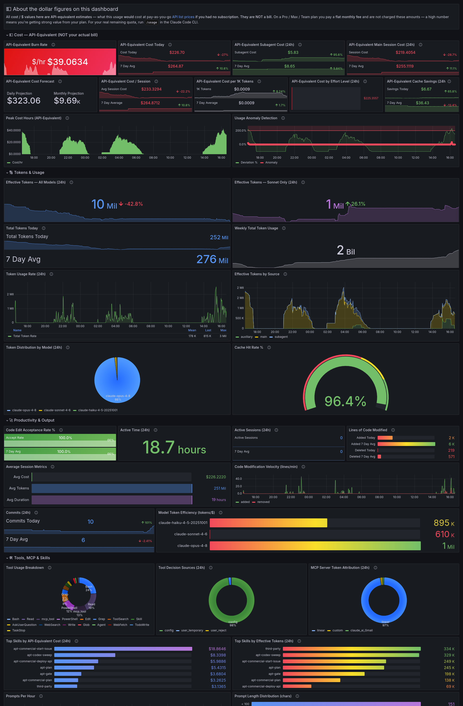


# agent-observability

A self-hosted monitoring stack for [Claude Code](https://claude.ai/code) **and [OpenAI Codex](https://openai.com/codex/)**. All telemetry stays in your own environment — nothing is sent to Anthropic, OpenAI, or any third-party service. Both tools already emit OpenTelemetry data throughout their operation — covering model requests, tool executions, prompts, edits, and session activity; this stack collects it, stores it, and surfaces it as Grafana dashboards.

**Stack:** OpenTelemetry Collector → Prometheus (metrics) + Loki (logs) → Grafana

Two agent dashboards ship with the stack: **Claude Code** (cost, tokens, cache, productivity) and **Codex** (sessions, tokens, latency, tools — log-sourced from Codex's OTel export, covering both the Codex CLI and the desktop app).

> ### 💵 A note on the cost figures
> Every dollar amount on the dashboard is **API-equivalent cost** — what your usage *would* cost at [pay-as-you-go API list prices](https://platform.claude.com/docs/en/about-claude/pricing) if you had no subscription. **It is not a bill.** Claude Code computes this estimate on every request (the metric is literally documented as *"cost_usd: Estimated cost in USD"*) regardless of how you're billed. If you're on a **Pro / Max / Team** plan you pay a flat monthly fee and are **not** charged these amounts — a high number means you're extracting strong value from your plan. Only metered **API / Console** users actually pay per token. The dashboard makes this explicit with a banner and panel labels so the numbers are never mistaken for money owed.

## What you get

- Real-time **API-equivalent** cost burn rate with trend comparison against yesterday and your 7-day average
- Subagent vs. main session cost breakdown — how much of your usage is autonomous work vs. direct conversation
- Daily and monthly cost projections, plus anomaly detection when an hour's usage deviates from your historical baseline
- Cache hit rate, cache-savings estimate, and cost per 1K tokens — whether your workflow is getting value from prompt caching
- Per-model token efficiency — tokens per dollar across Haiku, Sonnet, and Opus
- Effective (non-cached) token volume, broken out by source and by model
- Cost and token attribution by **skill**, **MCP server**, and **effort level**
- Lines of code added and removed, commits, edit acceptance rate, and modification velocity
- Tool call breakdown by type — Bash, Read, Edit, Write, and others — plus how each execution was authorized
- Prompt length and frequency patterns
- Response latency (p95) and request error counts
- Active CLI time vs. your active time, broken down by session
- Raw filterable log stream with session drill-down and full structured payloads

## Deployment options

Three ways to run the stack — pick the one that matches your environment. You only need one.

| Option | What you need | Best for |
|--------|---------------|----------|
| [Docker Compose](#docker-compose) | Docker and Docker Compose | Quickest start. Single machine, local or remote. No Kubernetes needed. |
| [Kubernetes (Kustomize)](#kubernetes) | A cluster and `kubectl` v1.14+ | Existing cluster without Helm. Raw manifests that are easy to inspect and edit. |
| [Helm](#helm) | A cluster and Helm v3 | Existing cluster with Helm. Cleanest to customize and upgrade. |

All three options deploy the same four services and the same Grafana dashboards. Each section below includes a clone step — start there regardless of which option you choose.

> **Already running an earlier version?** Skip the install steps and jump to **[Upgrading an existing deployment](#upgrading-an-existing-deployment)** for per-method update instructions (no data is lost).

---

## How it works

Claude Code has built-in support for [OpenTelemetry](https://opentelemetry.io/) (OTel) — an open standard for exporting telemetry from applications. When OTel export is enabled, Claude Code sends two streams of data continuously throughout its operation — not just on API calls, but on every tool execution, prompt, edit, and authorization event:

- **Metrics** — structured numeric data: token counts, cost, cache hits, session duration, code lines changed, tool call counts, and more. These flow through the OTel Collector into Prometheus, where Grafana queries them to build the dashboard panels.
- **Logs** — structured event records: every tool execution, user prompt, edit acceptance or rejection, and decision authorization. These flow through the OTel Collector into Loki, where Grafana queries them for the log explorer and log-sourced panels.

The four services and how they connect:

```
Claude Code
    │
    │  OTLP/HTTP (port 4318)
    ▼
OTel Collector
    ├── metrics ──► Prometheus ──┐
    │                            ├──► Grafana
    └── logs ─────► Loki ────────┘
```

The OTel Collector is the only service that needs to be reachable from wherever you run Claude Code. Prometheus, Loki, and Grafana communicate with each other internally. Grafana is the only service you need to reach in a browser.

---

## Configuring Claude Code

This configuration is the same regardless of which deployment option you chose. The only thing that differs is the endpoint URL — each deployment section calls out what to use.

OTel export is built into Claude Code with no plugins or extensions required. If you're on an older installation, run `claude update` to get the latest version before proceeding.

### Settings

Claude Code's `settings.json` supports an `env` block that sets environment variables for the process at startup. Add the following two variables, replacing `<your-collector-host>` with the endpoint for your deployment:

```json
{
  "env": {
    "OTEL_EXPORTER_OTLP_ENDPOINT": "http://<your-collector-host>:4318",
    "OTEL_EXPORTER_OTLP_PROTOCOL": "http/protobuf"
  }
}
```

**`OTEL_EXPORTER_OTLP_ENDPOINT`** — the base URL of the OTel Collector. Claude Code appends `/v1/metrics` and `/v1/logs` automatically. Use `http://localhost:4318` if the stack is on the same machine as Claude Code, or `http://<host>:4318` if it's running elsewhere.

**`OTEL_EXPORTER_OTLP_PROTOCOL`** — must be `http/protobuf`. The gRPC protocol is also supported by the collector on port 4317 but is not needed for most setups.

### Where is settings.json?

| Platform | Path |
|----------|------|
| macOS / Linux | `~/.claude/settings.json` |
| Windows | `%USERPROFILE%\.claude\settings.json` |

If the file doesn't exist yet, create it with the `env` block above. If it already exists, add the `env` block alongside your existing settings — don't replace the whole file:

```json
{
  "theme": "dark",
  "env": {
    "OTEL_EXPORTER_OTLP_ENDPOINT": "http://<your-collector-host>:4318",
    "OTEL_EXPORTER_OTLP_PROTOCOL": "http/protobuf"
  }
}
```

After saving, restart Claude Code. New sessions will begin exporting telemetry immediately; any sessions that were open when you saved need to be closed and reopened.

### Verifying it's working

Open Grafana and check the main dashboard. Within a few minutes of running Claude Code you should see non-zero values in **API-Equivalent Cost Today**, **Total Tokens Today**, and **Active Sessions (24h)**. The **Log Stream** on the Logs dashboard should show entries as well.

If panels stay empty after several minutes, see [Troubleshooting](#troubleshooting).

---

## Configuring Codex

The stack also ships a **Codex** dashboard. [OpenAI Codex](https://openai.com/codex/) has built-in OpenTelemetry support and exports structured log events for conversations, prompts, model turns (with token counts), tool calls, and decisions. Pointing Codex at the same OTel Collector makes its data appear in the Codex dashboard. This works for both the **Codex CLI** and the **Codex desktop app** — they share the same `config.toml` and emit the same events (under service names `codex_exec` and `codex-app-server` respectively).

### Settings

Codex is configured via `~/.codex/config.toml` (`%USERPROFILE%\.codex\config.toml` on Windows). Add an `[otel]` block pointing the log exporter at your collector's OTLP HTTP logs endpoint:

```toml
[otel]
environment = "prod"
log_user_prompt = false   # keep prompt text out of telemetry; prompt_length is still recorded

[otel.exporter.otlp-http]
endpoint = "http://<your-collector-host>:4318/v1/logs"
protocol = "binary"
```

**`endpoint`** — the collector's OTLP HTTP logs URL. Unlike Claude Code (which appends `/v1/logs` automatically), Codex's exporter takes the **full** path including `/v1/logs`. Use `http://localhost:4318/v1/logs` if the stack is on the same machine, or the collector's host/IP otherwise.

**`protocol = "binary"`** — OTLP protobuf over HTTP, which the collector accepts on port 4318.

**`log_user_prompt = false`** — recommended. Codex records `prompt_length` regardless, so the Prompt-per-hour panel works without capturing prompt contents.

The Codex dashboard is log-sourced only — Codex's telemetry carries token counts and latency but no per-request dollar cost, so the dashboard tracks **usage and performance**, not spend. If you also want Codex's traces/metrics elsewhere, configure `[otel.trace_exporter.otlp-http]` / `[otel.metrics_exporter.otlp-http]` separately; the Grafana dashboard only needs the logs exporter above.

After saving, restart Codex (fully quit the desktop app, or start a new CLI session) so it re-reads the config.

### Verifying it's working

Run a Codex command or a desktop session, then open the **Codex** dashboard in Grafana. Within a few minutes you should see non-zero values in **Total Conversations**, **Total Tool Calls**, and **Total Tokens**, and entries in the **Codex Event Stream** at the bottom.

---

## Docker Compose

### Setup

**1. Clone the repo:**

```bash
git clone https://github.com/KB1SLN-Labs/agent-observability.git
cd agent-observability
```

**2. (Optional) Adjust ports:**

If any default ports conflict with something already running on your host, copy `.env.example` to `.env` and change the values you need:

```bash
# macOS / Linux
cp .env.example .env

# Windows
copy .env.example .env
```

```env
GRAFANA_PORT=3000
OTLP_GRPC_PORT=4317
OTLP_HTTP_PORT=4318
PROMETHEUS_PORT=9090   # commonly conflicts — change this if needed
LOKI_PORT=3100
```

Only set the values you're changing. The defaults apply for anything you leave out.

**3. Start the stack:**

```bash
docker compose up -d
```

**4. Configure Claude Code:**

See [Configuring Claude Code](#configuring-claude-code) for full details. The endpoint depends on where the stack is running.

**Same machine as Claude Code:**

```json
{
  "env": {
    "OTEL_EXPORTER_OTLP_ENDPOINT": "http://localhost:4318",
    "OTEL_EXPORTER_OTLP_PROTOCOL": "http/protobuf"
  }
}
```

**Stack running on a remote host** — replace `<stack-host>` with the IP or hostname of the Docker machine:

```json
{
  "env": {
    "OTEL_EXPORTER_OTLP_ENDPOINT": "http://<stack-host>:4318",
    "OTEL_EXPORTER_OTLP_PROTOCOL": "http/protobuf"
  }
}
```

**5. Open Grafana:**

Navigate to `http://localhost:3000` (or `http://<stack-host>:3000` if running remotely). Dashboards load automatically — no login required.

### Data retention

Prometheus retains 30 days of metrics by default. Loki retains logs until disk pressure triggers cleanup. Both can be adjusted in `docker-compose.yml`.

### Ports

All ports are configurable via `.env` (see step 1 above for defaults). Only two ports need to be reachable from outside the Docker host: Grafana (for the browser UI) and the OTLP HTTP port (for Claude Code). Prometheus and Loki communicate internally and only matter if you want to query them directly.

### Stopping

```bash
docker compose down
```

To remove all stored data:

```bash
docker compose down -v
```

---

## Kubernetes

Manifests are in the `k8s/` directory and use [Kustomize](https://kustomize.io/), which is built into `kubectl` since v1.14 — no separate install needed.

### Setup

**1. Clone the repo:**

```bash
git clone https://github.com/KB1SLN-Labs/agent-observability.git
cd agent-observability
```

**2. Deploy to your cluster:**

```bash
kubectl apply -k k8s/
```

This creates the `claude-code-observability` namespace and deploys all four services. PersistentVolumeClaims are created using your cluster's default StorageClass. If your cluster doesn't have a default StorageClass configured (common on bare metal), you'll need to add a `storageClassName` to the PVC specs in `k8s/prometheus.yaml` and `k8s/loki.yaml` before deploying, or use the [Helm chart](#helm) where this is a simple values option.

Grafana and the OTel Collector use `LoadBalancer` services by default. If your cluster doesn't have a load balancer provisioner (bare metal, local clusters, etc.), change `type: LoadBalancer` to `type: NodePort` in `k8s/otel-collector.yaml` and `k8s/grafana.yaml` before running `kubectl apply`.

**3. Wait for external IPs to be assigned:**

```bash
kubectl get svc -n claude-code-observability --watch
```

Wait until both `otel-collector` and `grafana` show an `EXTERNAL-IP`. If you switched to NodePort, the assigned ports will appear under `PORT(S)`.

**4. Configure Claude Code:**

See [Configuring Claude Code](#configuring-claude-code) for full details. Point Claude Code at the OTel Collector's external IP:

```json
{
  "env": {
    "OTEL_EXPORTER_OTLP_ENDPOINT": "http://<otel-collector-external-ip>:4318",
    "OTEL_EXPORTER_OTLP_PROTOCOL": "http/protobuf"
  }
}
```

**5. Open Grafana:**

Navigate to `http://<grafana-external-ip>:3000`. Dashboards load automatically — no login required.

### Data retention

Prometheus and Loki each get a 10Gi PersistentVolumeClaim by default. Prometheus is configured to retain 30 days of metrics. Adjust PVC sizes in `k8s/prometheus.yaml` and `k8s/loki.yaml` before first deploy.

### Tearing down

```bash
kubectl delete -k k8s/
```

This removes all workloads and services but leaves the PersistentVolumeClaims intact so data survives accidental teardowns. To remove everything including stored data:

```bash
kubectl delete -k k8s/
kubectl delete pvc -n claude-code-observability --all
```

---

## Helm

The Helm chart is in the `helm/` directory. It deploys the same four-service stack as the Kubernetes manifests but all tunables — image versions, service types, PVC sizes, retention, resource limits — are in `values.yaml` rather than requiring direct manifest edits.

### Setup

**1. Clone the repo:**

```bash
git clone https://github.com/KB1SLN-Labs/agent-observability.git
cd agent-observability
```

**2. Install the chart:**

```bash
helm upgrade --install claude-code ./helm --namespace claude-code-observability --create-namespace
```

`upgrade --install` is safe to run multiple times — it installs on first run and upgrades on subsequent runs. Use it for both fresh installs and updates.

To override defaults — for example, to use a specific StorageClass or switch to NodePort:

```bash
helm upgrade --install claude-code ./helm \
  --namespace claude-code-observability \
  --create-namespace \
  --set prometheus.persistence.storageClass=standard \
  --set otelCollector.service.type=NodePort \
  --set grafana.service.type=NodePort
```

**3. Wait for external IPs to be assigned:**

```bash
kubectl get svc -n claude-code-observability --watch
```

Wait until `claude-code-otel-collector` and `claude-code-grafana` show an `EXTERNAL-IP`. If you switched to NodePort, the assigned ports will appear under `PORT(S)`.

**4. Configure Claude Code:**

See [Configuring Claude Code](#configuring-claude-code) for full details. Point Claude Code at the OTel Collector's external IP:

```json
{
  "env": {
    "OTEL_EXPORTER_OTLP_ENDPOINT": "http://<otel-collector-external-ip>:4318",
    "OTEL_EXPORTER_OTLP_PROTOCOL": "http/protobuf"
  }
}
```

**5. Open Grafana:**

Navigate to `http://<grafana-external-ip>:3000`. Dashboards load automatically — no login required.

### Customization

All values are in `helm/values.yaml`. The most commonly changed ones:

| Value | Default | Description |
|-------|---------|-------------|
| `prometheus.retention` | `30d` | How long Prometheus keeps metrics |
| `prometheus.persistence.size` | `10Gi` | Prometheus PVC size |
| `loki.persistence.size` | `10Gi` | Loki PVC size |
| `prometheus.persistence.storageClass` | `""` | StorageClass for Prometheus PVC (cluster default if empty) |
| `loki.persistence.storageClass` | `""` | StorageClass for Loki PVC (cluster default if empty) |
| `otelCollector.service.type` | `LoadBalancer` | `LoadBalancer` or `NodePort` |
| `grafana.service.type` | `LoadBalancer` | `LoadBalancer` or `NodePort` |
| `otelCollector.service.annotations` | `{}` | Annotations passed to the load balancer service — use this to select a specific load balancer class or configure cloud-specific behavior (e.g. AWS NLB, GCP internal) |
| `grafana.service.annotations` | `{}` | Same, for the Grafana service |

### Upgrading

```bash
helm upgrade --install claude-code ./helm --namespace claude-code-observability
```

Upgrades do not affect existing PersistentVolumeClaims or stored data.

### Tearing down

```bash
helm uninstall claude-code --namespace claude-code-observability
```

This removes all workloads and services but leaves the PersistentVolumeClaims intact. To remove everything including stored data:

```bash
helm uninstall claude-code --namespace claude-code-observability
kubectl delete pvc -n claude-code-observability --all
```

---

## Upgrading an existing deployment

If you already have the stack running from an earlier version, this section gets the new dashboard (five sections, API-equivalent cost labeling, plan-usage token panels, skill/MCP/effort attribution, latency and error panels) onto your running install. **No data is lost** — the dashboard is provisioned from config; your metrics and logs in Prometheus and Loki are untouched.

The only files that changed for the dashboard update are the two dashboard JSONs:

- `grafana/dashboards/claude-code.json` (used by Docker Compose and Kubernetes)
- `helm/dashboards/claude-code.json` (used by Helm — identical content)

**1. Pull the latest repo in all cases:**

```bash
cd agent-observability
git pull
```

Then follow the steps for your deployment method.

### Docker Compose

The dashboard JSON is mounted into the Grafana container and reloaded by Grafana's provisioner automatically (within ~30s). After `git pull`, restart Grafana so it re-reads the mounted file:

```bash
docker compose up -d --force-recreate grafana
```

If you don't see the new panels after a minute, hard-refresh the browser (Grafana caches dashboards client-side).

### Kubernetes (Kustomize)

The dashboard is delivered as a ConfigMap generated from the JSON files. Re-apply to regenerate it, then restart Grafana to pick up the new ConfigMap content:

```bash
kubectl apply -k k8s/
kubectl rollout restart deployment grafana -n claude-code-observability
```

> **Note:** a Grafana pod that has been running since before the ConfigMap changed will not always hot-reload a mounted ConfigMap reliably. The `rollout restart` above guarantees the new dashboard is mounted. Your PersistentVolumeClaims (metrics/logs) are not affected by the restart.

### Helm

```bash
helm upgrade --install claude-code ./helm --namespace claude-code-observability
kubectl rollout restart deployment claude-code-grafana -n claude-code-observability
```

`upgrade --install` re-renders the dashboard ConfigMap from `helm/dashboards/claude-code.json`. The `rollout restart` ensures the running Grafana pod mounts the updated content. PVCs and stored data are preserved.

### Verifying the upgrade

Open the main dashboard. You should see five section headers — **💵 Cost — API-Equivalent**, **🔢 Tokens & Usage**, **🚀 Productivity & Output**, **🛠️ Tools, MCP & Skills**, **⚡ Performance** — and a banner at the top explaining the cost figures. If you still see the old flat layout, hard-refresh the browser and confirm the Grafana pod/container was restarted.

### What changed in this version

- **Cost panels relabeled as "API-equivalent."** The dollar figures were always estimated API list prices, not actual subscription charges — the labels and a new banner now make this explicit so the numbers aren't mistaken for a bill.
- **New plan-usage token panels.** *Effective Tokens — All Models / Sonnet Only* show real (non-cached) token volume, the tokens that count toward Anthropic's limits. (An earlier draft tried to show these as a percentage-of-limit gauge, but OTel can't reconstruct the quota reset, so they report honest volume instead — use `/usage` in the CLI for true remaining quota.)
- **New attribution panels.** Cost and tokens broken down by **skill**, **MCP server**, and **effort level**.
- **New output and performance panels.** **Commits**, **Response Latency p95 by Model**, and **Request Errors**.
- **Reorganized into five labeled sections** with no dead space.
- No changes to the OTel Collector, Prometheus, or Loki configuration — telemetry collection is unchanged, so no Claude Code reconfiguration is needed.

---

## Troubleshooting

**Panels show no data after setup**

1. Confirm the `OTEL_EXPORTER_OTLP_ENDPOINT` in `settings.json` matches the host and port the OTel Collector is actually listening on.
2. Check that port 4318 is reachable from the Claude Code machine to the collector host — firewalls are a common cause.
3. Make sure Claude Code was fully restarted after saving `settings.json`, not just opened in a new terminal tab within an existing session.
4. Confirm the OTel Collector container or pod is running and healthy (`docker compose ps` or `kubectl get pods -n claude-code-observability`).

**Metrics appear but log-sourced panels are empty**

Log-sourced panels include Tool Usage Breakdown, Tool Decision Sources, Prompts Per Hour, Prompt Length Distribution, Response Latency p95 by Model, and Request Errors. If these show no data while cost and token panels are working, the log pipeline specifically isn't reaching Loki. Check:

1. The Loki container or pod is running and healthy.
2. The OTel Collector logs don't show errors exporting to Loki (`docker compose logs otel-collector` or `kubectl logs -n claude-code-observability deployment/loki`).
3. The Logs dashboard shows entries in the Log Stream panel — if it does, the data is in Loki and the issue is likely a query or time range mismatch on the affected panels.

**Grafana shows "No data" on a specific panel**

Expand the time range. Some panels (especially 7-day averages and anomaly detection) need at least a few days of data to produce meaningful output. The picker defaults to the last 24 hours — widen it for more history, but if the stack was just installed, the 7-day-average and anomaly panels won't have enough data yet regardless.

---

## Dashboard reference

There are two dashboards: **Claude Code** (main) and **Claude Code — Logs**.

### Claude Code (main)

Panels respect the dashboard time picker (default: last 24 hours) — stat, gauge, pie, and bar panels show data for the selected range, so widening the picker to 7 or 30 days widens what they report. A handful of panels keep an intentional fixed window (Real-Time Burn Rate is a 30-minute trailing rate, Cost Forecast extrapolates a 6-hour rate, Weekly Total Token Usage is a fixed 7 days, and the "vs 7-day average" baselines on stat panels are always a rolling 7-day comparison). The dashboard refreshes every 5 minutes. Most stat panels show the current value alongside that 7-day rolling average, and sparkline panels add a percentage-change indicator vs the prior equivalent window.

The dashboard is organized into five collapsible sections: **Cost (API-Equivalent)**, **Tokens & Usage**, **Productivity & Output**, **Tools, MCP & Skills**, and **Performance**. A banner at the top restates that all dollar figures are API-equivalent estimates, not actual charges.

---

### 💵 Cost — API-Equivalent (NOT your actual bill)

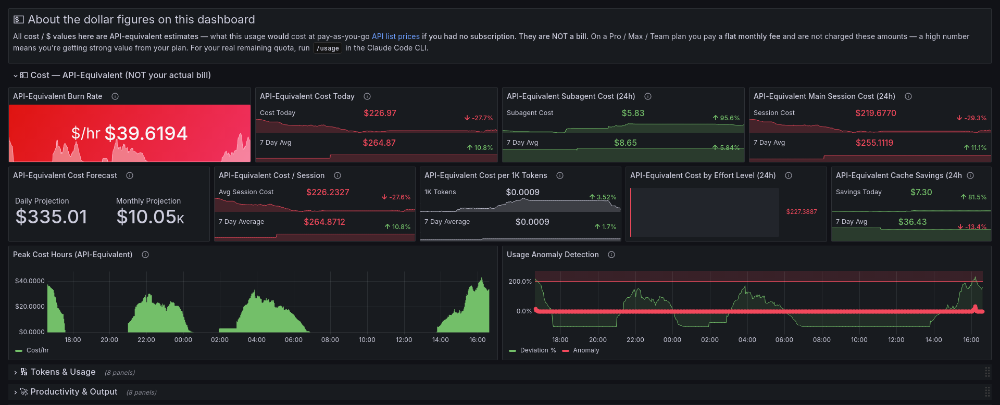

Every panel in this section is denominated in **API-equivalent cost** — what your usage would cost at pay-as-you-go API list prices if you had no subscription. On a Pro/Max/Team plan you are not charged these amounts (see the [note on cost figures](#-a-note-on-the-cost-figures) above). They remain useful as a measure of usage intensity and of the value you're getting from a flat-fee plan.

#### API-Equivalent Burn Rate

Current usage rate in API-equivalent dollars per hour, calculated from a 30-minute trailing window. The window is intentionally wide — Claude Code emits metrics per request rather than continuously, so a shorter window zeros out between turns. Background turns green below $0.50/hr, yellow up to $2.00/hr, red above.

#### API-Equivalent Cost

API-equivalent cost over the selected time range alongside the 7-day rolling daily-average baseline. The percentage change compares the current window to the prior equivalent one. If the current value is well above your 7-day average and trending up, check whether a session is accumulating more context than usual.

#### API-Equivalent Subagent Cost

API-equivalent cost attributed to spawned subagent tasks — parallel research, background code review, multi-agent work. Compare against Main Session Cost to understand what fraction of your usage is autonomous parallel work versus direct conversation. Includes the 7-day average and today-vs-yesterday change.

#### API-Equivalent Main Session Cost

API-equivalent cost from primary conversation turns: your prompts and Claude's direct responses. Excludes subagent and auxiliary tasks. Includes the 7-day average and percentage change.

#### API-Equivalent Cost Forecast

Daily and monthly projections of API-equivalent cost extrapolated from the current 6-hour burn rate. The 6-hour window smooths out short spikes — what you see reflects sustained activity. On a subscription plan a high projection is a value signal, not an upcoming bill.

#### API-Equivalent Cost / Session

Average API-equivalent cost per session over the selected time range compared to the 7-day average. A rising number over multiple days usually means sessions are running longer without being compacted — context accumulates and each turn costs more to process.

#### API-Equivalent Cost per 1K Tokens

Effective API-equivalent cost per 1,000 tokens across all token types. Cache reads cost roughly 10% of input price, so a well-cached workflow will push this number well below the model's headline rate. Includes the 7-day average and percentage change. Rising cost-per-token despite stable usage typically means cache efficiency has dropped.

#### API-Equivalent Cost by Effort Level

API-equivalent cost grouped by the effort setting (low / medium / high / max) over the selected time range. Effort controls the model's thinking-token budget. A large share at high or max effort is worth checking against whether those tasks actually needed deep reasoning.

#### API-Equivalent Cache Savings

Estimated API-equivalent dollars saved by prompt caching over the selected time range, versus the 7-day average. Computed as cacheRead tokens × the input-vs-cache price difference (Sonnet $2.70/1M, Haiku $0.72/1M). On a subscription plan this is an efficiency/value figure, not cash back.

#### Peak Cost Hours (API-Equivalent)

API-equivalent cost per hour as a bar chart. Spikes show which hours were most usage-intensive — cross-reference with sessions you remember running during those periods.

#### Usage Anomaly Detection

Hourly usage (measured via API-equivalent cost) expressed as percentage deviation from the 7-day historical average for the same hour. A value of 0% means today matches the historical average; 200% means it's three times higher. Excursions above 200% are flagged in red — investigate what was running during those periods. This is a relative usage signal, not a dollar amount owed.

---

### 🔢 Tokens & Usage

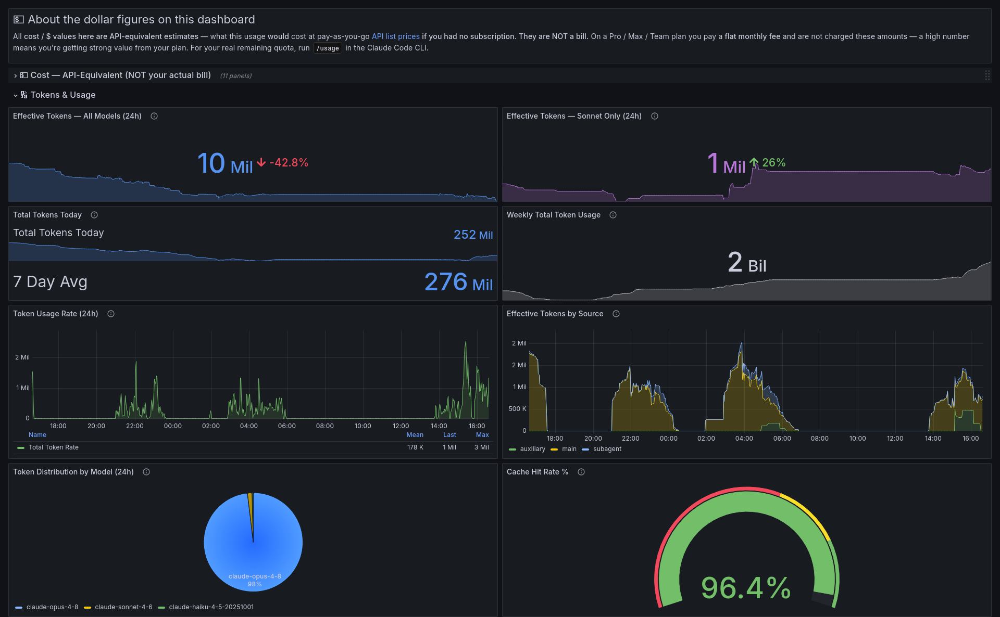

#### Effective Tokens — All Models

Actual effective (non-cacheRead) tokens consumed across all models over the selected time range, with a 7-day sparkline trend. These are the tokens that count toward Anthropic's usage limits — cacheRead tokens are excluded because they don't count the same way. This is a real measured volume, **not** a percentage of any limit: OTel telemetry can't reconstruct your quota gauge because the weekly reset boundary isn't exported. For true remaining quota, run `/usage` in the Claude Code CLI.

#### Effective Tokens — Sonnet Only

The same effective-token measure scoped to Sonnet, which has its own separate usage cap at Anthropic. A 7-day sparkline shows the trend.

#### Total Tokens

All tokens consumed over the selected time range across all types, alongside the 7-day daily average.

#### Weekly Total Token Usage

Total tokens consumed over the last 7 days with a sparkline showing the daily trend. A consistently rising slope means usage is accelerating.

#### Token Usage Rate (24h)

Total tokens consumed per minute. The legend table shows mean, last, and peak rates for the selected window. Use this to gauge proximity to your plan's TPM rate limit — if the rate is approaching your ceiling, starting a fresh session or running `/compact` is the right move.

#### Effective Tokens by Source

Hourly effective (non-cacheRead) tokens stacked by query source: `main` (direct conversation turns), `auxiliary` (background context builds), and `subagent` (parallel spawned agents). A rising subagent share means Claude is doing more autonomous orchestration relative to interactive work.

#### Token Distribution by Model

Pie chart showing the share of total tokens consumed by each model. Sonnet dominating is expected for most workloads. A large Opus slice is worth checking — Opus costs roughly 5x Sonnet per token, and many tasks don't require it.

#### Cache Hit Rate %

Percentage of input-side tokens served from Anthropic's prompt cache. Above 80% is healthy. Below 60% suggests sessions may be too short to warm the cache effectively, or context structure is preventing cache blocks from being reused. Gauge arc turns red below 60%, yellow up to 80%, green above.

---

### 🚀 Productivity & Output

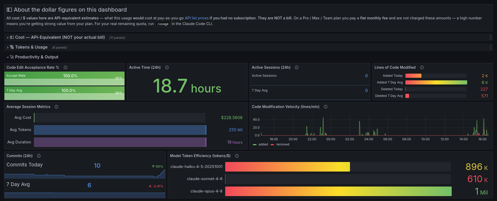

#### Code Edit Acceptance Rate %

Percentage of Claude's proposed file edits that were accepted over the selected time range, plus the 7-day average. Below 80% is worth investigating — the most common causes are context drift mid-session, an ambiguous task description, or Claude losing track of the codebase structure. Background turns red below 60%, yellow up to 80%, green above. Shows "No edits" if no edit activity occurred in the window.

#### Active Time

Two values side by side: CLI time (how long Claude Code was running and processing) and User time (how long you were actively engaged — typing, reviewing). A high CLI-to-user ratio means Claude is doing a lot of autonomous work between your interactions.

#### Active Sessions

Number of Claude Code sessions started over the selected time range, alongside the 7-day daily average and prior-window change.

#### Lines of Code Modified

Lines added and deleted today alongside 7-day rolling daily averages for each. A large gap between today and the 7-day average indicates an unusually active or unusually quiet day.

#### Average Session Metrics

Three horizontal bars showing per-session averages across the selected time range: API-equivalent cost ($), total token count, and active CLI time. Rising values across multiple days point to sessions accumulating context without being reset. A useful complement to API-Equivalent Cost / Session — if cost is rising but token count is flat, a more expensive model is being used more often.

#### Code Modification Velocity (lines/min)

Lines added and removed per minute as a timeseries. Green is additions, red is removals. Spikes indicate concentrated editing bursts. A sustained high removal rate relative to additions typically means refactoring or large-scale cleanup.

#### Commits

Git commits made via Claude Code over the selected time range, compared to the 7-day daily average. Pairs with the lines-of-code panels to show shipped output, not just edit volume.

#### Model Token Efficiency (tokens/$)

Total tokens per API-equivalent dollar, broken down by model, over the selected time range. Higher is more efficient. Haiku should significantly outperform Opus given the price difference. If the gap is narrower than expected, check whether model selection is being overridden somewhere.

---

### 🛠️ Tools, MCP & Skills

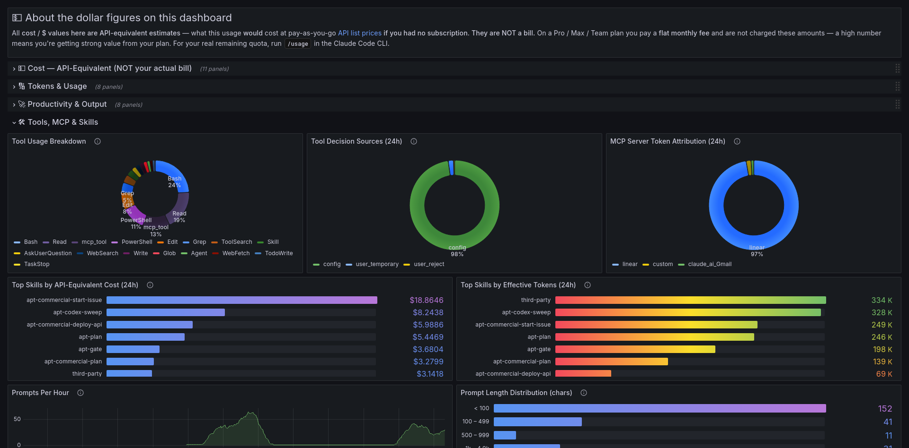

#### Tool Usage Breakdown

Donut chart of tool calls by type over the selected time range, sourced from structured logs. Covers all tools: Bash, Read, Edit, Write, Glob, Grep, and others. Heavy Bash usage points to shell-and-test work; heavy Edit/Write usage is more code generation.

#### Tool Decision Sources

Donut chart showing how tool executions were authorized: via CLAUDE.md or settings (`config`), approved once for the session (`user temporary`), or added to the permanent allow list (`user permanent`). A high `user temporary` fraction means you're approving many tools interactively that could be moved to config.

#### MCP Server Token Attribution

Donut chart of token consumption attributed to MCP server calls over the selected time range. Only turns that invoked an MCP tool carry the server-name label, so this shows which MCP integrations are driving context size. User-configured (non-registry) servers appear as `custom`.

#### Top Skills by API-Equivalent Cost

Horizontal bars ranking named skills by the API-equivalent cost of the turns where they were active, over the selected time range. Turns without an active skill are excluded. High-cost skills often have large context windows or expensive prompt templates worth reviewing. (Third-party plugin skill names are redacted to `third-party` by Claude Code.)

#### Top Skills by Effective Tokens

The same skill ranking by effective (non-cacheRead) token volume. A skill high in tokens here but low in the cost panel is getting strong cache reuse; a skill high in both is a genuine cost driver.

#### Prompts Per Hour

Count of user prompt events over a rolling 1-hour window, sourced from structured logs. Peaks show concentrated interaction periods; flat sections are idle time.

#### Prompt Length Distribution (chars)

Character count distribution across five buckets: under 100, 100–499, 500–999, 1k–4.9k, and 5k+, sourced from structured logs. Most prompts are short. Long prompts (1k+) usually indicate pasted code, error output, or a detailed task description. A spike in the 5k+ bucket during a session that went expensive is often the explanation.

---

### ⚡ Performance

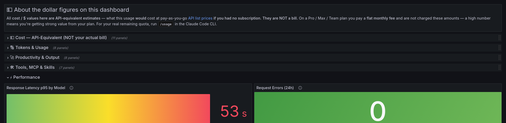

#### Response Latency p95 by Model

95th percentile response time per request, broken down by model, over the selected range — sourced from structured request logs. This is how long Anthropic's servers take to respond, a real performance signal for everyone regardless of plan or billing. Higher Sonnet latency vs Haiku reflects longer reasoning chains; sustained spikes above baseline signal context-window pressure or server backpressure. Bars turn yellow at 30s, red at 60s.

#### Request Errors

Count of failed requests over the selected time range — rate-limit rejections, network errors, and model errors returned by Anthropic's servers. Applies to all users regardless of plan. Green at zero; any errors turn the panel yellow, 5+ turns it red. Drill into the Logs dashboard for detail.

---

### Claude Code — Logs

A dedicated log explorer linked from the main dashboard. Filter by severity level and optionally paste a session ID to scope to a single session.

#### Errors / Warnings / Total Entries / Active Sessions

Stat tiles showing counts for the selected time range. Scan these first to gauge whether a period had unusual error rates before opening the full log stream.

#### Log Volume Over Time

Error, warning, and total log entry counts per minute as a timeseries. Error and warning spikes here are the signal to scroll down and investigate.

#### Log Stream

Full filterable log stream. Set the Level variable to narrow by severity. Paste a session ID in the Session ID field to isolate a single session. Click any row to expand the full structured payload.

---

### Codex

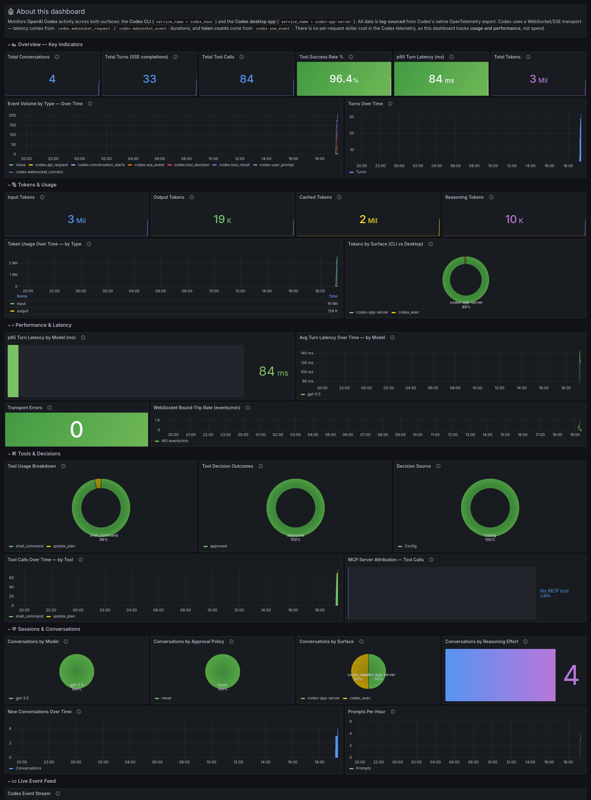

Monitors **OpenAI Codex** across both surfaces — the **Codex CLI** (`service_name = codex_exec`) and the **Codex desktop app** (`service_name = codex-app-server`). Every panel is log-sourced from Codex's OpenTelemetry export. Codex uses a WebSocket/SSE transport, so latency comes from WebSocket round-trip durations and token counts come from SSE completion events. There is no per-request dollar cost in Codex's telemetry, so this dashboard tracks **usage and performance**, not spend.

The section structure deliberately **mirrors the Claude Code dashboard** — Tokens & Usage, Productivity & Output, Tools/MCP/Skills, and Performance appear in the same order with the same names — so you can move between the two dashboards without re-orienting. Codex adds two of its own sections (Sessions & Conversations, Live Event Feed) for data Claude Code doesn't expose. Where Claude Code has a Cost section, Codex has none — its telemetry carries no cost figures.

#### 🔢 Tokens & Usage

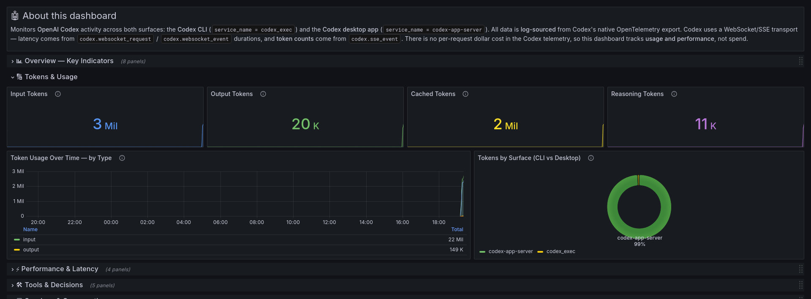

Token stats — **Input**, **Output**, **Cached**, and **Reasoning** — sourced from `codex.sse_event`, alongside totals for **Tokens**, **Turns**, and **Conversations**. **Token Usage Over Time** stacks token types by hour to spot context growth, and **Tokens by Surface** splits output-token volume between the CLI and the desktop app.

#### 🚀 Productivity & Output

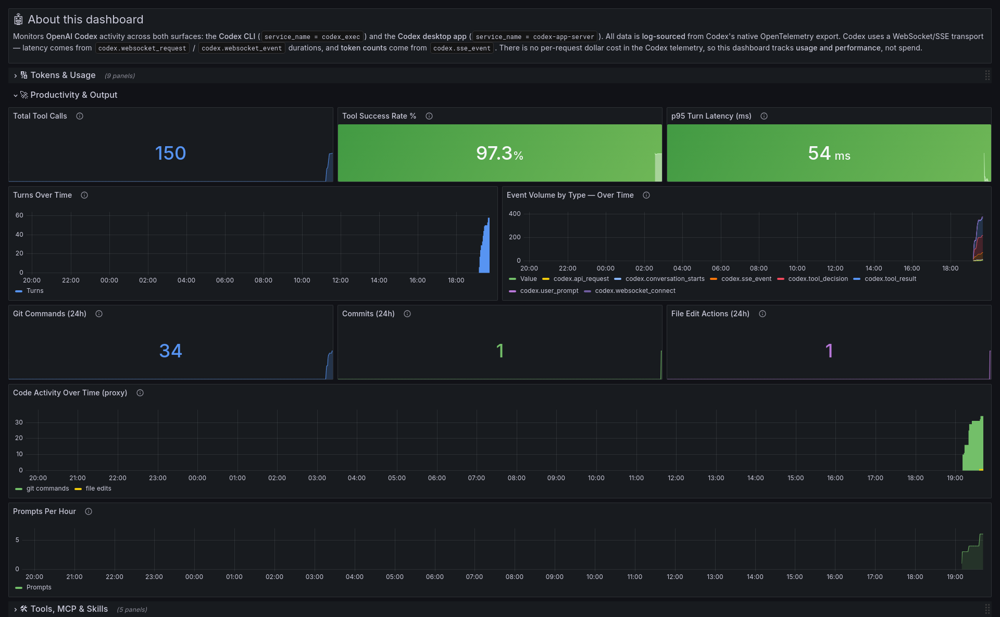

Codex's output signals: **Total Tool Calls**, **Tool Success Rate %** (red below 70%, green above 85%), and **p95 Turn Latency**, plus **Turns Over Time**, **Event Volume by Type**, and **Prompts Per Hour**. The parallel to Claude Code's Productivity & Output section — what the agent is actually producing and how reliably.

**Code-activity proxies.** Claude Code emits native git telemetry (lines-of-code, commit, and edit-decision counters); **Codex emits none of this** — its OTel stream has no lines-of-code, commit, or diff fields. To give a comparable signal anyway, this section derives proxies from Codex's shell command stream (the `arguments` field on `codex.tool_result`): **Git Commands**, **Commits** (`git commit` invocations), **File Edit Actions** (`Set-Content` / `Out-File` / `apply_patch` etc.), and a **Code Activity Over Time** chart — all respecting the dashboard time picker. These are *command-derived counts*, not native metrics or true line counts — Codex routes file edits through the shell, so the proxy counts edit *actions*, not edited lines. Treat them as activity indicators, not exact figures.

#### 🛠️ Tools, MCP & Skills

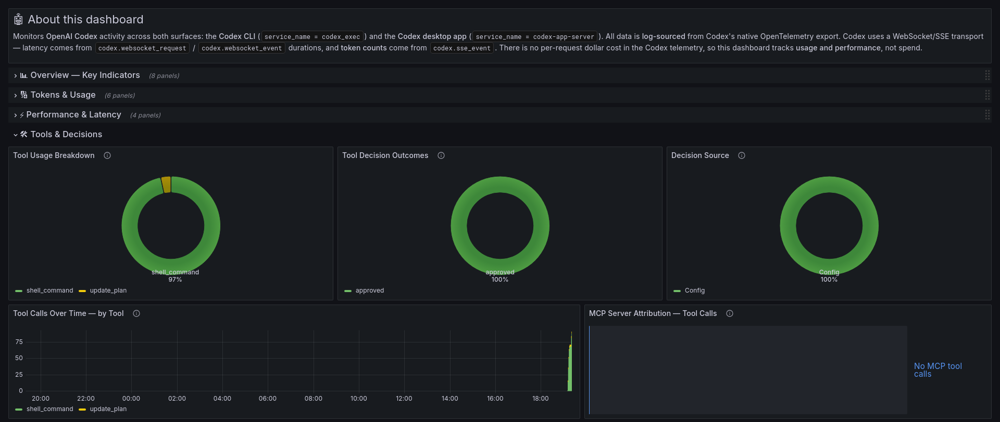

**Tool Usage Breakdown** (by `tool_name`), **Tool Decision Outcomes** (approved / denied / ask), and **Decision Source** (config policy vs interactive approval), plus **Tool Calls Over Time** and **MCP Server Attribution** for tool calls that ran through an MCP server.

#### ⚡ Performance

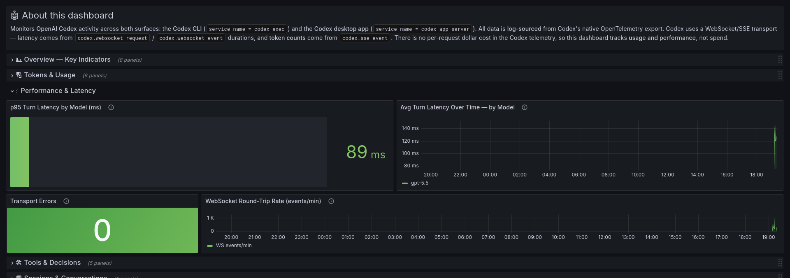

**p95 Turn Latency by Model** (WebSocket round-trip, yellow at 5s / red at 15s), **Avg Turn Latency Over Time by Model**, **Transport Errors** (WebSocket events with `success="false"`), and **WebSocket Round-Trip Rate** (transport throughput per minute).

#### 💬 Sessions & Conversations  *(Codex-specific)*

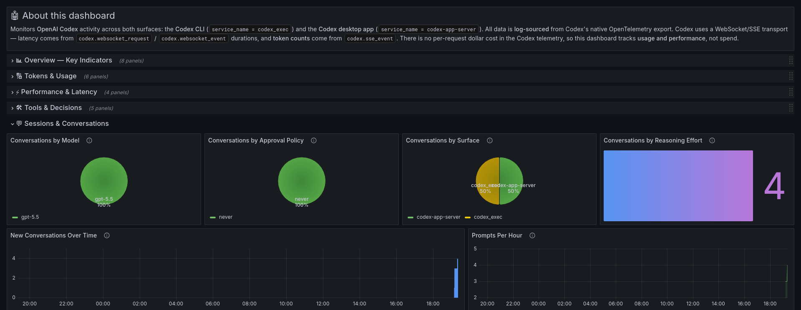

Conversation distribution by **Model**, **Approval Policy**, **Surface** (CLI vs desktop), and **Reasoning Effort**, plus **New Conversations Over Time**.

#### 📜 Live Event Feed  *(Codex-specific)*

The raw Codex event stream (both surfaces), with high-volume WebSocket noise filtered out. Click any line to expand the full structured payload.

### Codex — Logs

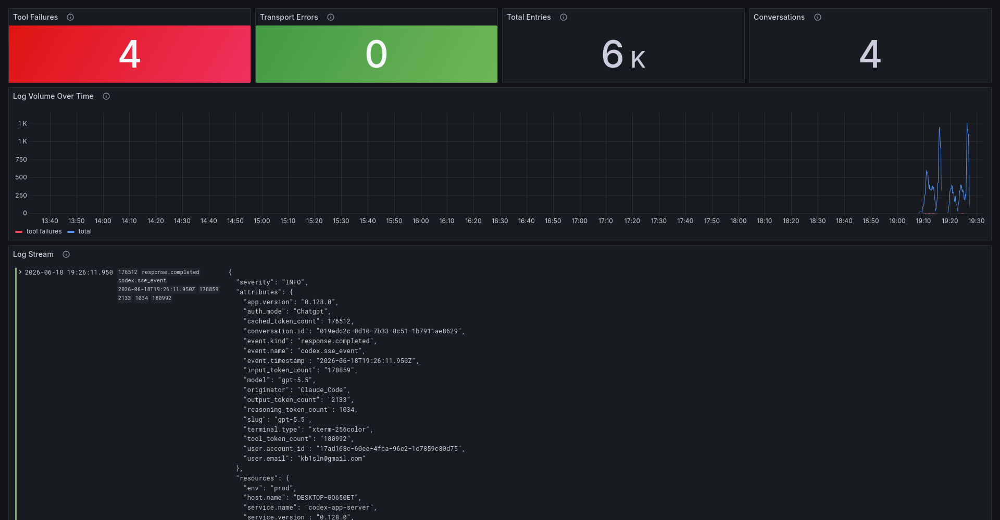

A dedicated Codex log explorer, linked from the main Codex dashboard — the counterpart to the Claude Code Logs dashboard. Filter by **Surface** (CLI / desktop), **Event** type (conversation_starts, user_prompt, sse_event, tool_result, tool_decision, websocket_event), and **Conversation ID**. Stat tiles surface **Tool Failures**, **Transport Errors**, **Total Entries**, and **Conversations**; **Log Volume Over Time** overlays tool failures on total volume; and the **Log Stream** shows the filtered raw events with expandable structured payloads.
